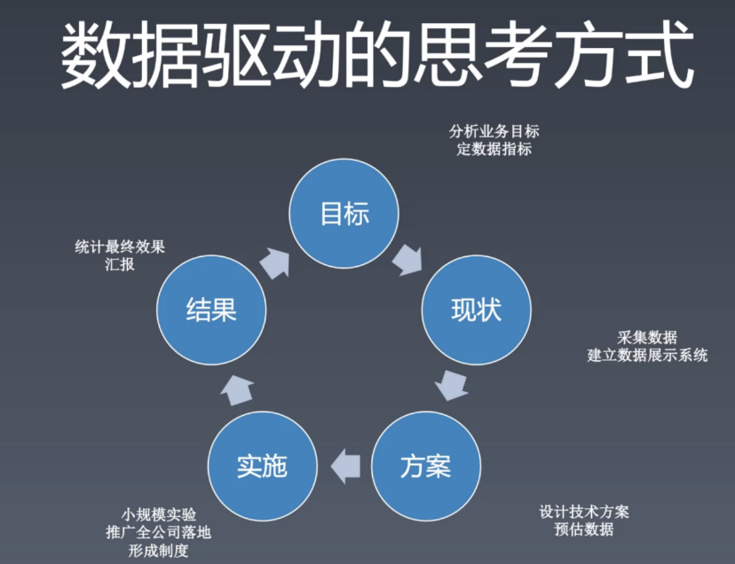

# who are the owner of your career

### 数据驱动的思考方式

所以当你想在团队内做一个事情时：

1. 目标：目标最好能跟公司业务指标，或者团队痛点挂钩；
2. 现状：能够量化的表示现在的现状。比如图形化你的数据；
3. 方案：设计你的技术方案，并且能够预估收益，以此来调动资源；
4. 实施：发现潜在问题，验证方案；
5. 结果：大规模上线

### 技术架构

客户端架构：解决软件需求规模带来的复杂性

服务端架构：解决大量用户访问带来的复杂性

前端架构：解决大量页面需求带来的重复劳动问题

前端技术架构最重要的使命就是**复用**，提高复用率，如何复用？

- 库：有复用价值的代码(例：URL, ajax, ENV)
- 组件：UI上多次出现的元素(例：轮播图)
- 模块：经常被使用的业务区块(例：登录)
